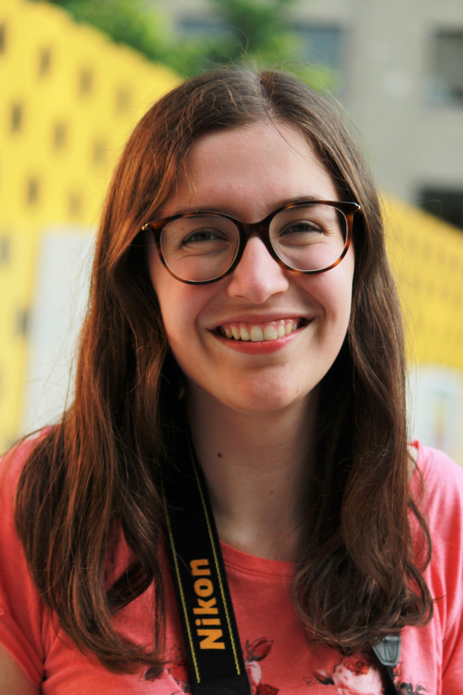

I am an AI researcher interested in neurosymbolic methods and sequence modeling, especially where structure and learning interact. I have research experience in constraint programming and Transformer-based sequence generation, applied AI experience from RL pathfinding work at Ubisoft.
Add me on [LinkedIn](https://www.linkedin.com/in/liliane-caroline-demers/)!

In 2024, I won the 1st prize and People's Choice Award at the Three-Minute Eastern Canada Regional Final Competition (3MT) at INRS, [watch it here](https://www.youtube.com/watch?v=dHB6TP2GPXs&ab_channel=Institutnationaldelarecherchescientifique&t=29m33s)!

# Research
* **Sequence Generation with Long-Term Structure Using CP and ML (applied to symbolic music generation)**
  * [“Music Generation with Long-Term Structure Using Constraint Programming and Transformer-Based 
Decoders,”](https://filuta.ai/papers/CompAI_2025_paper_7.pdf) with Professor Gilles Pesant
    * Composite AI Workshop, International Joint Conference on Artificial Intelligence (IJCAI) 2025 
(workshop paper and talk)
    * Journées de l’optimisation (JOPT) 2024 (talk)
    * Doctoral Program, International Conference on Principles and Practice of Constraint Programming 
(CP) 2023 (paper, talk and poster) 
## Studies
* 2024: Masters at Polytechnique Montréal in Artificial Intelligence
* 2022: Bachelor degree at Polytechnique Montréal in Software Engineering with option in Artificial Intelligence

## Work Experience
- October 2025: Research consultant at Adexflow
- May-Sept 2025: Communication Coordinator and Lead Student Journalist for IJCAI 2025 - ([Read my interviews here!](https://aihub.org/author/liliane-carolinedemers/))
- 2020-2022: AI, Tools and Web Development at Ubisoft
- 2020 - 2021: Teacher's Assistant in Networking (INF3405) at Polytechnique Montréal
- 2019: Developper at Hydro-Québec

# Other interests

I've loved music since I started piano at six years old, especially Chopin, Debussy, Liszt, Beethoven, Eugénie Rocherolle, and André Mathieu.
I escape in books, and I am always up for some ice skating, a tennis match or a swim.

